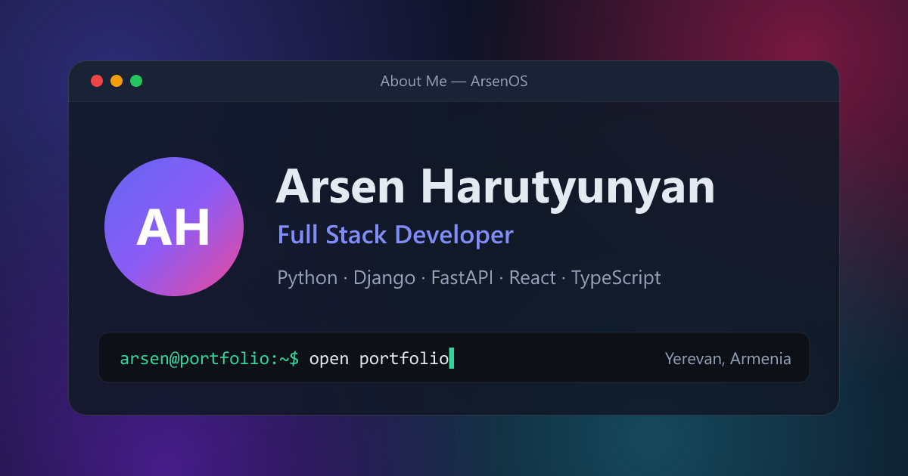

# Portfolio

My personal site: **https://portfolio-phi-lilac-83.vercel.app**



I didn't want another one-page portfolio, so this one looks like a small desktop OS. You open "apps" from the desktop, move windows around, use the start menu, or type commands into the terminal (`help` is a good start). On a phone it switches to a home screen with app icons.

If you're a recruiter and just want the facts, go to [`/quick`](https://portfolio-phi-lilac-83.vercel.app/quick). Same content, one normal scrolling page.

## What's inside

- Desktop with draggable, resizable windows, taskbar, start menu and a Ctrl+K command palette
- Terminal with a few commands (`about`, `skills`, `projects`, `open contact`, `lang hy`, `theme`...)
- English, Russian and Armenian. Light and dark theme.
- Contact form that saves messages to Postgres and sends me an email (plus an auto-reply to the sender)
- My CV as a PDF, generated by the backend in the selected language

All the facts (jobs, projects, skills, contacts) live in one file, `src/data/content.json`, and the texts are in `src/i18n/locales`. The website and the CV PDF both read from there, so when I update something I do it once and both stay in sync.

## Stack

**Frontend:** React 19, TypeScript, Vite, Tailwind CSS v4, Zustand, Motion, react-rnd, React Hook Form + Zod, i18next

**Backend:** FastAPI, SQLAlchemy, Pydantic, fpdf2 for the PDF

**Database:** PostgreSQL on Supabase

**Hosting:** Vercel. The frontend is static, and the API runs as a Python serverless function from `api/index.py`.

## How I built it

I built this with vibe coding, working with Claude Code. I decided what the site should be and how it should behave, described each piece, then reviewed, tested and changed what came back until I was happy with it. It was also a good way to see how far you can get with AI tools on a real project, and where you still have to step in yourself.

## Running it locally

You need Node 22.12+ and Python 3.12.

```bash
npm install
python -m venv .venv
.venv/Scripts/pip install -r requirements-dev.txt   # on macOS/Linux: .venv/bin/pip

cp .env.example .env    # fill in the database URL and the Gmail app password
npm run db:init         # creates the table for contact messages, only needed once
npm run dev             # site on localhost:5173, API on localhost:8000
```

Without SMTP settings the contact form still works, it just saves the message and skips the email.

Other commands:

- `npm run build` – type check and production build
- `npm run lint` – oxlint
- `npm run test:api` – backend tests (pytest)
- `npm run i18n:sync` – copies new keys from `en.json` into the ru/hy files without touching existing translations
- `npm run og` – regenerates the link preview image

## Project layout

```
src/
  apps/         one component per "app": About, Projects, Skills, Terminal...
  components/   desktop shell (windows, taskbar, start menu) and the mobile home screen
  data/         content.json + small TS files that add icons and types
  i18n/         translations
  pages/        desktop and quick view
backend/        FastAPI app, contact form, CV generator, tests
api/index.py    entry point for Vercel
```

## Contact

arsen.harutyunyan088@gmail.com · [LinkedIn](https://www.linkedin.com/in/harutyunyanpy) · [Telegram](https://t.me/Harutyunyan_a88)
